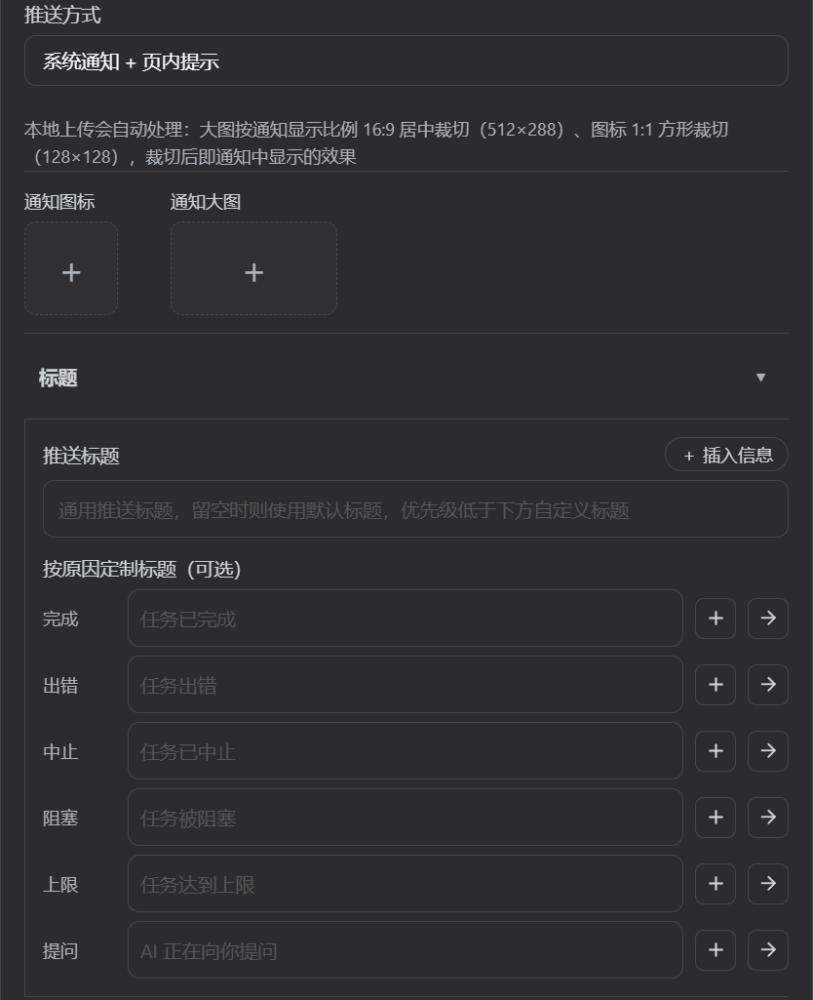
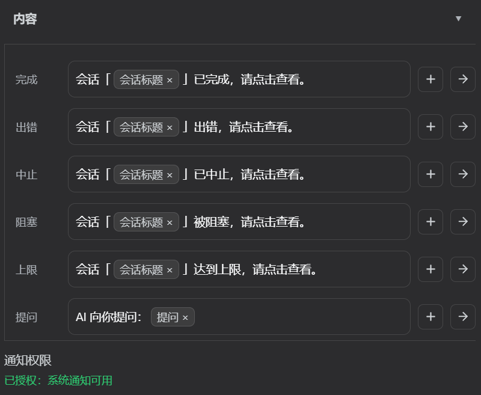
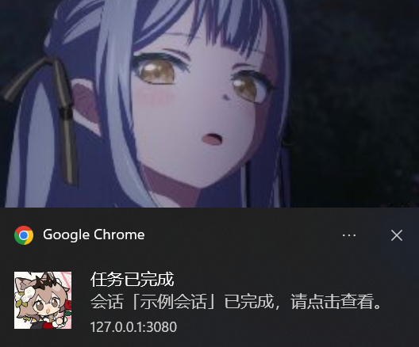

<div align="center">

# dsh-session-notify

[简体中文](README.md) · [English](README.en.md) · **繁體中文** · [日本語](README.ja.md) · [한국어](README.ko.md)

**DSH（DeepSeek Harness）會話完成提醒外掛 —— 每一輪結束，讓完成狀態主動找你，而不是你盯著畫面等。**

[](https://www.npmjs.com/package/@telosmaylx/dsh-session-notify)
[](https://www.npmjs.com/package/@telosmaylx/dsh-session-notify)
[](./LICENSE)
[](https://www.npmjs.com/package/@telosmaylx/dsh-session-notify)
[](https://www.npmjs.com/package/@telosmaylx/dsh-session-notify)
[](https://github.com/TelosmaYLX/dsh-session-notify/pulls)

每輪對話結束時，把「已完成 / 出錯 / 被阻塞 / 達到上限」連同用時、token 消耗寫入會話日誌，並推送瀏覽器系統通知與頁內 toast（**視窗失焦 / 聚焦可分別指定通道，兩路都含「不通知」**）；**AI 向你提問、請求審批時同樣立即彈窗提醒**，不必守著會話頁面。內建 5 種語言、4 套風格預設（顏文字 / 艾露貓 / 貓娘 / DeepSeek 娘）、視覺化文案模板編輯器、自訂預設庫，快取命中率與生成速度取自官方投影，與狀態列同口徑。

</div>

---

## 目錄

- [功能特色](#功能特色)
- [環境需求](#環境需求)
- [安裝](#安裝)
- [解除安裝](#解除安裝)
- [快速開始](#快速開始)
- [通知行為](#通知行為)
  - [觸發條件](#觸發條件)
  - [推送內文從哪來](#推送內文從哪來)
  - [通知範例](#通知範例)
  - [通知權限](#通知權限)
- [設定](#設定)
  - [設定面板](#設定面板)
  - [文案模板與佔位符](#文案模板與佔位符)
  - [預設系統](#預設系統)
  - [宿主設定項](#宿主設定項)
- [運作原理](#運作原理)
- [專案結構](#專案結構)
- [開發與除錯](#開發與除錯)
- [常見問題](#常見問題)
- [更新紀錄](#更新紀錄)
- [致謝](#致謝)
- [貢獻](#貢獻)
- [相關連結](#相關連結)
- [授權條款](#授權條款)

---

## 功能特色

<div align="center">






</div>

### 三通道提醒，一條不漏

| 通道 | 形式 | 說明 |
| --- | --- | --- |
| 會話內系統訊息 | 可收合的提示列 | 每輪結束把結束原因與用時、消耗作為外掛來源的系統訊息附加進會話日誌，隨 JSONL 寫入磁碟，還原或重播會話後依然可見。 |
| 瀏覽器系統通知 | Web Notification | 原生彈出視窗。每次完成事件使用獨立 `tag`（`dsh-session-notify:<timestamp>`），不會與前一次互相取代，也不會被收合成一個分組項目；點擊通知聚焦回視窗。 |
| 頁內 toast | 右下角浮動彈出視窗 | 永遠顯示的保底通道：系統通知被平台靜默、權限拒絕或環境不支援時仍有可見回饋。同畫面最多 3 條（超出移除最舊），10 秒自動消失，點擊關閉。 |

> [!NOTE]
> 後兩條通道**按視窗聚焦狀態分流**：設定面板中「失焦時」「聚焦時」各有一個下拉，可選 `雙通道` / `僅系統通知` / `僅頁內提示` / `不通知`。判定失焦的條件是 `document.visibilityState === 'hidden'` 或 `!document.hasFocus()`，也就是分頁被切走、視窗被最小化或點到別處時，走「失焦時」那一路。

### 背景會話全覆蓋

- 宿主為所有會話（含背景、未開啟視窗的）維護「最近一則通知內文」的會話投影單元（key = `session-complete-notify`），推送內文跨會話一致，不依賴你剛好開著那個視窗。
- 用戶端從會話清單快照觀測所有會話的 `running` 位元，`true → false` 邊緣即觸發推送，與官方 sidebar 提醒同策略（首次觀測只記錄基線，已在 idle 的會話不補發）。

### 提問即時提醒

- AI 呼叫 `ask_user_question` 向你提問時，宿主立刻把「提問標題 + 內文」寫入獨立投影單元（key = `session-complete-notify-question`），用戶端即時輪詢並彈窗提醒——**即使你正看著別的頁面，也不會錯過提問**。
- 提問文案完全可自訂：標題走「按原因自訂標題 → 全域標題 → 預設標題」鏈路，內文支援 `{question}` 佔位符（注入 AI 的實際提問），媒體開關 `{image}` / `{icon}` / `{audio}` 同樣生效。

### 審批即時提醒

- 會話請求權限審批時（`approval/asked`）立刻提醒，`approval/decided` 後失效——切到其他分頁也不會漏掉審批。
- 三路信號兜底：harness 原生 `pendingInteractions`（宿主提供時最準）→ 宿主審批投影（key = `session-complete-notify-approval`，標題與內文由宿主按當前語言渲染）→ 會話列表快照的 `pendingInteraction === 'approval'`。
- 文案只含工具名與可選原因（如「會話請求使用 Bash，請前往審批。（原因：…）」），**絕不含命令參數等敏感內容**；推送通道與媒體設定同樣生效。

### 可自訂到每一句話

- **5 種語言**：簡體中文、繁體中文、English、日本語、한국어 —— 通知文案、時長與用量措辭、設定面板介面全部隨語言切換（切換即時重渲染）。
- **視覺化模板編輯器**（Chip 膠囊編輯器）：動態資訊渲染為內聯膠囊（佔位符程式碼不露出），「＋ 插入資訊」在游標處插入（可插到文字中間），點擊膠囊移除，每欄帶即時預覽（資訊以範例值流入內文）。
- **預設系統**：內建「預設」基線 + 4 套一鍵風格預設（顏文字 / 艾露貓 / 貓娘 / DeepSeek 娘——標題與 5 結束原因 + 提問正文整套風格化文案）；目前設定可另存為自訂預設（`localStorage` 持久化），支援自動編號的未命名預設（`未命名`、`未命名 2`…）、「來自：xxx · 已修改」來源指示、刪除預設。
- **推送標題模板**：留空時各原因用預設標題（完成=任務已完成 / 出錯=任務出錯 / … / 提問=AI 正在向你提問）；`{title}` 引用會話標題。

### 與官方口徑同源

- **快取命中率**取自官方 `tokenUsage` 投影：快取讀 /（未快取輸入 + 快取讀 + 快取寫）。
- **生成速度**取自官方 `sessionStats` 投影：輸出 token ÷ 解碼耗時。
- 兩者與 dsh-web-ui 狀態列完全同口徑，不含排隊、準備、工具時間；投影不可用或資料未就緒時自動回退為本地用量彙總估算。

> [!NOTE]
> 快取命中率與速度只在自訂模板中透過 `{cache}`、`{tps}` 佔位符插入時才顯示。使用內建預設文案時，內文不含用時與消耗（要顯示資料需在自訂模板中插入對應佔位符）。

### 工程品質

- **只回應即時事件**：resume、replay 不重播舊通知，載入會話不洗版。
- **自免疫迴圈**：外掛附加的訊息類型（`user/message`）與自身監聽目標（`turn/*`）不相交。
- **零外部依賴**：宿主平面零裸 import，UserMessage 按 `dsh-llm` 的 `createUserMessage` 契約手工構造；純邏輯層（`lib/core.js`）零依賴，可獨立測試。
- **Cordis effect 紀律**：重試計時器包裝在 `ctx.effect()` 中並回傳 `clearTimeout` disposer，註冊隨 fiber 卸載自動撤銷，HMR 熱重載安全。
- **安裝即掛載**：宣告官方 `dsh.bundle` manifest，`dsh plugin add` 一條指令裝完即用，無需手寫 patch。
- **零依賴自檢**：`npm run selftest` 跑 `scripts/selftest.mjs`——宿主 schema 與 sanitize、用戶端純邏輯與接線、設定面板渲染冒煙、提示音播放鏈路、README × 5 一致性，全部為可執行斷言，發布前必跑。

---

## 環境需求

| 依賴 | 需求 |
| --- | --- |
| DSH（DeepSeek Harness） | **0.1.x 與 0.2.0-rc.2 起**（目前實測 0.2.0-rc.2）。Web profile 部署；官方 base bundle 預設包含 `@deepseek-ai/dsh-settings` 與會話投影，兩代設定契約由外掛自動適配，無需設定 |
| cordis | `>=4.0.0-rc <5`（peer dependency，由宿主提供） |
| Node.js | `>=22`（宿主側） |
| 瀏覽器 | 支援 Web Notification 則有系統通知；不支援、權限拒絕或被靜默時由 toast 保底 |

兩代宿主的**設定契約不同，外掛自動適配，無需任何設定**：

| 環境 | 設定命名空間 | 設定面板入口 |
| --- | --- | --- |
| dsh 0.1.x | 外掛自選：`session-complete-notify`（`ctx.settings.register`） | 宿主 `settingsScope` → `settings.plugin.item` 槽位 |
| dsh 0.2.0-rc.2 起 | profile entry id：`dsh-session-notify` | 宿主 `configForms` → `plugins.bundle.config` / `plugins.row.config` / `settings.plugins.tab` 槽位 |

> 0.1.x 的程式路徑保持不變，但最近一輪改動只在 0.2.0-rc.2 上做過端到端回歸；舊宿主上 `schemastery` < 3.18.3 時自動跳過 `volatile()`（0.1.x 不需要它）。

---

## 安裝

> [!WARNING]
> 裸 `npm install` 只會把套件裝進依賴樹，**不會註冊外掛** —— 這是 DSH 官方設計（`npm install only adds the dependency; it does not register the plugin`）。自動掛載的唯一官方途徑是 `dsh plugin add`：它讀取套件內 `dsh.bundle` manifest（此外掛自 0.1.3 起宣告，指向儲存庫根 `cordis.patch.yml`）並自動套用。

### 方式一：dsh plugin add（推薦）

安裝套件的同時自動套用 `cordis.patch.yml`，把外掛掛載進 profile 組合（host 事件訂閱 + client 啟動圖注入）。

```bash
dsh plugin --profile web add @telosmaylx/dsh-session-notify
```

### 方式二：從 GitHub 儲存庫安裝

```bash
dsh plugin add github:TelosmaYLX/dsh-session-notify
```

也可以在 DSH Web GUI 會話內執行：

```bash
dev_install_package github=TelosmaYLX/dsh-session-notify
```

### 方式三：本地目錄熱掛載（開發用）

把路徑換成你的克隆目錄，在 DSH Web GUI 會話內執行：

```bash
dev_install_package dir=/你的/克隆目录/dsh-session-notify
```

### 方式四：npm 套件手動安裝

先打包：

```bash
npm pack @telosmaylx/dsh-session-notify
```

解壓縮後指定目錄安裝（在 DSH Web GUI 會話內執行）：

```bash
dev_install_package dir=/解压/目录/package
```

### 方式五：手動 cordis patch（不依賴安裝器）

在 `~/.dsh/profiles/web/cordis.patch.yml` 附加：

```yaml
- insert:
    - id: dsh-session-notify
      name: '@telosmaylx/dsh-session-notify'
      config: {}
```

> [!IMPORTANT]
> 無論用哪種方式，裝完都需要**重新整理一次瀏覽器頁面** —— 用戶端 bundle 透過 `__DSH_BOOT__` 啟動圖注入。

## 解除安裝

一條指令移除外掛及其掛載（自動從 `cordis.patch.yml` 移除 insert 項目）：

```bash
dsh plugin --profile web remove @telosmaylx/dsh-session-notify
```

> [!NOTE]
> 手動安裝（方式四/五）的使用者，需同步從 `~/.dsh/profiles/web/cordis.patch.yml` 刪除對應 insert 項目，再重新整理頁面。

### 解除安裝時自動清理的內容

外掛實作了完整的生命週期收尾（Cordis effect 紀律），解除安裝/停用/HMR 熱重載時：

| 平面 | 自動釋放的資源 |
| --- | --- |
| host | `session/event` 事件訂閱、settings 命名空間、會話投影單元、設定註冊重試計時器（`ctx.effect` 包裝）；置解除安裝旗標抑制已排程的微任務附加 |
| client | 會話清單訂閱、完成推送內文的輪詢計時器、`window.__dsch_notify_debug` 除錯鉤子（按參考刪除，防閉包洩漏）、頁內 toast 容器 DOM |

### 解除安裝後保留的資料

- **設定組態**（語言、文案模板）留在 settings 文件，重裝後自動恢復；
- **自訂預設**存於瀏覽器 `localStorage`（`dsh-scn-custom-presets`），重裝後仍在；
- 歷史會話中已附加的系統訊息與 JSONL 日誌**不會**被回滾（它們是會話資料的一部分，與官方側邊欄提示同語意）。

---

## 快速開始

1. 按上面任一方式安裝並重新整理頁面。
2. 發起任意一輪對話，等它結束 —— 右下角彈出 toast、瀏覽器彈系統通知、會話日誌裡出現可收合的系統提示列。
3. 首次收到完成事件時，瀏覽器會請求通知權限（每頁只問一次），允許後後續完成都有系統通知。
4. 開啟 **設定 → 外掛 → 會話完成提醒**，切換語言、編輯文案模板、另存預設。儲存後點「點擊重新整理」讓宿主與用戶端兩側重新讀取，新設定即生效。

剛裝好時，會話日誌裡會出現這樣一行可收合提示：

```text
会话「重构登录模块」已完成（用时 1 分 12 秒，消耗 1,240 输入 / 3,560 输出）。
```

> 預設文案在「會話」後內嵌會話標題標籤（`{title}`）；會話無標題時自動退回「會話已完成」。

---

## 通知行為

### 觸發條件

每輪對話結束（`turn/end`）時按結束原因判斷，命中白名單即提醒：

| 結束原因 | 含義 | 預設 |
| --- | --- | --- |
| `completed` | 會話正常完成 | 提醒 |
| `aborted` | 會話中止 | 提醒 |
| `blocked` | 會話被阻塞 | 提醒 |
| `error` | 會話出錯（附錯誤詳情，超長截斷） | 提醒 |
| `max-tokens` | 達到輸出 token 上限 | 提醒 |
| `interrupted` | 中斷（崩潰復原後由持久化後端補寫的孤兒輪次關閉標記） | 不提醒（可設定加入） |

**子代理會話預設跳過**（`header.origin === 'subagent'` 或 `delegationDepth > 0`）—— 子代理由父會話編排，逐輪提醒是噪音；可在宿主設定關閉跳過。

**提問是獨立通道，不走上面的白名單**：AI 呼叫 `ask_user_question` 等待你回答時（`tool/call` 事件）立即提醒，`tool/result` 返回後提醒失效。提問不寫會話日誌，只彈通知。

**審批也是獨立通道**：會話請求權限審批時（`approval/asked`）立即提醒，`approval/decided` 後失效。同樣不寫會話日誌，只彈通知；標題與內文只含工具名與可選原因，不含命令參數。

### 推送內文從哪來

用戶端在會話清單觀測到 `running: true → false` 邊緣時推送，內文按以下優先級取得（最長輪詢 6 秒，400ms 間隔）：

1. **宿主投影**（key = `session-complete-notify`）—— 每個會話都有，背景會話同樣拿到全文；
2. **會話事件視窗裡的 notice 節點**（`kind=context` + `form=notice`）—— 正在查看的會話，寫入磁碟後立即可用；
3. **降級** —— 「詳情見會話內系統訊息」+ 工作區資訊（`cwd` 最後一段）。

提問提醒的內文同樣優先取宿主投影（key = `session-complete-notify-question`，宿主已渲染好標題與內文），老宿主無該投影時用戶端自行拼接標題與 `{question}` 文字兜底。

審批提醒按可用性三路取源：harness 原生 `pendingInteractions` → 宿主審批投影（key = `session-complete-notify-approval`）→ 會話列表快照的 `pendingInteraction` 欄位；取到即提醒，同一審批只推一次。

### 通知範例

以下均由 `lib/core.js` 的 `buildNotice` 實際生成。預設文案統一為「會話「{title}」已xx，請點擊查看。」句式（按結束原因差異用詞；**不含用時與消耗**）：

繁體中文預設文案：

```text
會話「重构登录模块」已完成，請點擊查看。   ← 完成
會話「重构登录模块」已中止，請點擊查看。   ← 中止
會話「重构登录模块」被阻塞，請點擊查看。   ← 阻塞
會話「重构登录模块」達到上限，請點擊查看。 ← 上限
會話「重构登录模块」出錯，請點擊查看。     ← 出錯
```

> 會話無標題（`titleValue` 為空）時自動回退「會話已完成，請點擊查看。」；用時/消耗/快取命中/速度等資料只在自訂模板中透過 `{duration}` `{usage}` `{cache}` `{tps}` 佔位符插入時顯示。

自訂模板（在設定面板編輯，本例用到全部資訊位）：

```text
{title} 干完了！用时 {duration}，消耗 {usage}，缓存命中 {cache}，速度 {tps}
```

渲染結果：

```text
重构登录模块 干完了！用时 3 分 25 秒，消耗 103,600 输入 / 35,600 输出，缓存命中 96.5%，速度 92 tok/s
```

五種語言的同一事件：

```text
会话「重构登录模块」已完成（用时 3 分 25 秒，消耗 1,240 输入 / 3,560 输出）。
會話「重構登入模組」已完成（用時 3 分 25 秒，消耗 1,240 輸入 / 3,560 輸出）。
Session "重构登录模块" completed (took 3m25s, used 1,240 in / 3,560 out).
セッション「重构登录模块」完了（所要 3 分 25 秒、消費 1,240 入力 / 3,560 出力）。
세션「重构登录模块」 완료（소요 3분 25초, 소모 1,240 입력 / 3,560 출력）。
```

### 通知權限

| 權限狀態 | 行為 |
| --- | --- |
| `default`（未決定） | 完成事件只發 toast；設定面板「通知權限」區提供「請求授權」按鈕（**使用者手勢內請求**——Chromium 會忽略非手勢的自動請求，因此外掛不再自動請求） |
| `granted` | 按「失焦時」「聚焦時」各自所選通道發系統通知（獨立 tag，互不覆蓋；選「不通知」則不彈） |
| `denied`（被瀏覽器封鎖） | 僅 toast；設定面板顯示網址列操作指引（權限圖示 → 網站設定 → 通知 → 允許） |
| `undefined`（非安全上下文 / 不支援） | 僅 toast；建議改用「僅頁內提示」 |

---

## 設定

絕大多數設定在 **DSH Web UI → 設定 → 外掛 → 會話完成提醒** 面板完成（儲存後點「點擊重新整理」生效）。僅「觸發原因白名單」在宿主 `cordis.patch.yml` 的 `config` 中設定（跳過子代理在面板中以核取方塊控制）。

### 設定面板

面板在官方「設定 → 外掛」面板中註冊（`settings.plugin.item` keyed slot，key = `session-complete-notify`），樣式逐值復刻原生外掛卡片（12px 圓角、展開收合、旋轉 chevron、footer 狀態位 + 棄置 ghost + 主色儲存按鈕）：

| 區域 | 內容 |
| --- | --- |
| 預設 | 下拉選擇內建或自訂預設；「新增」把目前設定另存為自訂預設；目前預設可「刪除」 |
| 語言 | 5 種語言單選，切換即時重渲染整個面板 |
| 失焦時 | 四選一：**不通知**（該時機完全靜默）/ 雙通道（系統通知 + 頁內提示，預設）/ 僅系統通知 / 僅頁內提示 —— 視窗失焦（切走分頁、最小化、點到別處）時生效 |
| 聚焦時 | 四選一：同上（預設雙通道）—— 視窗聚焦時生效。兩路互相獨立，可自由組合成「失焦系統通知 + 聚焦不通知」等搭配 |
| 音訊 | 摺疊區（**預設展開**，點摺疊頭的 ▾ 可收起）：提示音的音量與時長。展開後是**「音量」+ 滑桿同一行**（**「音量」二字在滑桿前面**，滑桿右側顯示百分比與「試聽 / 停止」按鈕：0~100%，**內部存 0~1**，預設 60%；**試聽按當前音量播放**——拖完滑桿點一下就能聽出效果，**播放中按鈕變「停止」，再點一次即停**，未設定任何提示音時按鈕停用）與**「時長」行**（同一行順序：**標籤 → 滑桿 → 數值框 → 秒**；滑桿量程 **0~15 秒**、步長 **0.1 秒**，拖動即改，也可直接在數值框裡輸入任意秒數；**預設 0 = 不限制**，設為 N 秒後音訊到點仍未播完 → **0.5 秒音量淡出後停止**，音訊本身比上限短時自然播完；**只影響播放，上傳的音訊原樣保存、不截斷**）。兩項寫入設定文件的 `volume` / `maxDuration`；第三行是**「全域提示音」**（未設定顯示「新增音訊」按鈕，已設定顯示 `WAV · 5 KB` 這樣的類型/體積摘要 + 「替換 / 試聽 / 清除」），寫入 `globalAudio`——**內容沒為該狀態指定音訊時播放它**（優先順序：該狀態指定的音訊 > 全域提示音；都沒有則不播放） |
| 通知圖片 | 大圖兩種來源：**按原因上傳**——在模板中透過「＋ 插入資訊 → 圖片」插入 `{image}` 標籤並選擇本機圖片（編輯器內顯示為帶縮圖的標籤，**自動壓縮至 512px 寬、按通知顯示比例 16:9 居中裁切**，隨各原因獨立儲存）；**全域大圖/圖示**——兩張上傳卡片並排一行（**圖示在前**，空態 = 圓角矩形 + 號，點擊上傳；**大圖 512×288（16:9 居中裁切）、圖示 128×128（1:1 方形居中裁切）**；已上傳則卡片顯示縮圖，**點擊縮圖可全螢幕查看完整原圖（等比未裁切）**，右上角 × 刪除）。圖示留空用網站預設圖示，也可在模板中插入 `{icon}` 標籤**按原因指定圖示**（優先於全域）。僅系統通知通道生效（頁內 toast 為文字卡片），「傳送」測試按鈕同樣生效 |
| 標題 | 摺疊區（**預設收起**，點擊展開）：**全域推送標題**（所有原因共用，Chip 編輯器——點「＋ 插入資訊」插入的資訊以**膠囊標籤**形式顯示，點擊膠囊移除；**通知發送時標題裡的資訊位（用時/消耗/錯誤/快取命中/速度）會替換為實際值，不再顯示代碼**；留空時各原因用預設標題——完成=任務已完成、出錯=任務出錯、中止=任務已中止、阻塞=任務被阻塞、上限=任務達到輸出上限、提問=AI 正在向你提問）+ **按原因自訂標題**（6 條原因各自輸入，每行帶「+」插入按鈕——可插入資訊標籤（含「提問」，不含圖片/圖示），插入到游標處；**優先於全域標題**，留空 = 用全域或語言預設標題） |
| 內容 | 摺疊區（**預設收起**，點擊展開）；展開後每條結束原因（完成、出錯、中止、阻塞、輸出上限、提問）**一行式佈局**（原因標籤 + Chip 編輯器 + 「+」插入按鈕——選單展開時變「−」+ **紙飛機發送按鈕**，按鈕為矩形、垂直居中）：**空模板（預設預設）時編輯器顯示預設文案**，文字 + 內聯資訊膠囊，游標處插入；`{image}`/`{icon}` 標籤**點擊縮圖可預覽大圖、點 × 才刪除**（防誤刪），`{audio}` 標籤**點播放圖示試聽、播放中變成暫停圖示、再點即停，點 × 才刪除**（同樣防誤刪；刪除標籤只清掉該原因的音訊資料，正文原樣保留），其他標籤點擊移除；**編輯後刪空則顯示「留空則使用預設文案」佔位（不可選取/刪除）**；提問行的預設文案為「AI 向你提問：{question}」，`{question}` 會在發送時替換為 AI 的實際提問（插入選單同樣提供「提問」標籤，與其他標籤同款互動） |
| 跳過子代理會話 | 核取方塊（儲存時一併寫入設定文件） |
| 通知權限 | 狀態即時顯示：已授權（綠）/ 尚未授權（附「請求授權」按鈕）/ 已被瀏覽器封鎖（附網址列操作指引）/ 環境不支援 |
| 按原因自訂標題 | 收合區（預設收合）：每個結束原因一個獨立標題輸入框，留空 = 用全域模板或語言預設標題 |
| 儲存 | 寫入宿主設定文件（`language` / `templates` / `titleTemplate` / `titleTemplates` / `pushModeBlur` / `pushModeFocus` / `skipSubagents` / `audios` / `globalAudio` / `volume` / `maxDuration`）；**只寫真正變更的欄位**（其餘一律不動），儲存期間按鈕停用；儲存後顯示「點擊重新整理」連結 |
| 重置 | 一鍵還原預設值（**語言保留目前選擇**，標題/模板/失焦聚焦通道/提示音/時長恢復預設）並立即儲存 |

> [!NOTE]
> 「失焦時」「聚焦時」的通道取捨：`dual`（預設）同時彈 Windows 系統通知與頁內 toast，toast 是保底通道，防止系統通知被平台靜默（專注小幫手、通知橫幅關閉）。兩路互相獨立，可組合成「失焦時系統通知、聚焦時不打擾」。**舊設定不受影響**——設定文件裡沒有 `pushModeBlur` / `pushModeFocus` 時，兩路都沿用舊版單一 `pushMode` 的值。但 **QQ 瀏覽器等國產 Chromium 殼瀏覽器會把 `Notification` 渲染成「瀏覽器內建的頁內推送彈出視窗」**（頁面頂部/角落的橫幅，不經 Windows 通知中心）——此時 `dual` 會造成頁內兩個提示（瀏覽器內建彈出視窗 + 外掛 toast）。這類瀏覽器請選「僅頁內提示」（不再呼叫 `Notification`，瀏覽器內建彈出視窗不會出現，頁內只有外掛自己的小 toast）；「僅系統通知」模式在 QQ 瀏覽器無效（它永遠渲染為頁內彈出視窗）。設定面板每個原因的「傳送」測試按鈕同樣受此影響——測試通知優先走「聚焦時」那一路，該路為「不通知」時改用「失焦時」那一路，兩路都關則回落 `dual`，保證預覽總有回饋。

> [!NOTE]
> 系統通知（`Notification` API）能否彈出由**瀏覽器與網站存取方式**共同決定：Edge/Chrome 對"不熟悉"的網站會**自動封鎖通知**（網址列出現「通知已封鎖」）——點擊網址列左側權限圖示 → 網站設定 → 通知 → 允許即可恢復；`http://IP` 這類非安全上下文存取時 `Notification` 根本不存在，請改用「僅頁內提示」。設定面板「通知權限」區域會即時顯示目前狀態並給出對應操作指引（可一鍵請求授權）。Firefox 視窗聚焦時通知顯示為頁內橫幅、失焦才進系統通知中心。

> [!NOTE]
> 面板中「跳過子代理會話」儲存的是設定文件裡的布林值；宿主 `cordis.patch.yml` 的 `config.skipSubagents` 是其啟動預設值，兩者任一為真即跳過。

### 文案模板與佔位符

每條結束原因獨立一個模板輸入框，**標籤即開關** —— 在模板裡插入對應資訊標籤，該項資料才會顯示：

| 佔位符 | 含義 | 範例值 |
| --- | --- | --- |
| `{title}` | 會話標題（推送標題模板也可用） | `重構登入模組` |
| `{duration}` | 本輪用時（`turn/start` 起表 → `turn/end` 結束） | `3 分 25 秒` / `3m25s` |
| `{usage}` | token 消耗（輸入 = 未快取 + 快取讀 + 快取寫） | `1,240 輸入 / 3,560 輸出` |
| `{error}` | 錯誤資訊（無錯誤時顯示 `none`；單行化，80 字元截斷） | `connection timeout` |
| `{cache}` | 快取命中率（官方投影口徑，無資料為空） | `96.5%` |
| `{tps}` | 生成速度（官方投影口徑，無資料為空） | `92 tok/s` |
| `{image}` | 自訂通知大圖開關：從「＋ 插入資訊」插入並選擇本機圖片（自動壓縮至 512px），按原因獨立；正文渲染時剝除，不寫入會話日誌；刪除標籤時該原因圖片資料一併清除 | — |
| `{icon}` | 自訂通知圖示開關：從「＋ 插入資訊」插入並選擇本機圖片（自動壓縮至 128×128 方形），按原因獨立；正文渲染時剝除，不寫入會話日誌；優先於全域「通知圖示」；刪除標籤時該原因圖示資料一併清除 | — |
| `{audio}` | **自訂提示音開關**：從「＋ 插入資訊 → 音訊」插入並選擇本機音訊檔（mp3/wav/ogg… **原樣讀取**，不壓縮、不截斷；>512 KB 會先確認），按原因獨立；**預設為空（不設定就沒有提示音）**，音量與「時長」由面板「音訊」摺疊區裡的「音量」滑桿 / 「時長」行（**滑桿 0~15 秒、步長 0.1** + 數值框，**預設 0 = 不限制**，超時 0.5 秒淡出）統一控制，**試聽即按當前音量**；**點標籤上的播放圖示試聽、播放中變成暫停圖示再點即停**，**點標籤上的 × 才刪除**（刪除只清掉該原因的音訊資料與標籤，正文不受影響）；正文渲染時剝除，不進會話日誌；**同個狀態只允許一個**（已插入時選單按鈕變灰，重複標籤儲存時自動剝除）。**是否播放由「已儲存」的範本決定**（點儲存後重新整理生效，與面板其他項目一致）——插了標籤**且為該狀態選了音訊**才用它；否則播放「音訊」區裡的**全域提示音**（兩者都沒有才靜音） | — |
| `{question}` | **提問行的專屬佔位符**：發送時替換為 AI 的實際提問文字；與「＋ 插入資訊」選單聯動（可直接選「提問」標籤，手輸 `{question}` 同樣識別為膠囊），僅提問通道可用，其他原因行插了也會被替換為空（防字面量洩漏） | `要繼續生成報告嗎？` |
| `{label}` | 已廢棄 —— 渲染時自動剝除，舊模板仍相容（插入選單已移除該選項） | — |

模板留空即使用內建預設文案（「會話「{title}」已xx，請點擊查看。」句式，不含用時與消耗）。收合行 `summary` 與內文同源（渲染結果截斷至 120 字元）—— 只看收合行的使用者也能看到真實標題與用時、消耗。

### 預設系統

- **內建預設**：僅「預設」，作為基線。
- **自訂預設**：儲存在 `localStorage`（key = `dsh-scn-custom-presets`）：
  - 「新增」命名後儲存為自訂預設；儲存後可「修改」自動同步、「刪除」移除；
  - **自動編號的未命名預設**：從「預設 / 空白」直接儲存時，自動生成 `未命名`、`未命名 2`、`未命名 3`…（編號取目前最大值 + 1）；
  - 表單顯示「來自：xxx · 已修改」來源指示（來自預設但內容已改動時）。
- **儲存即同步**：儲存時若表單來源是自訂預設則更新該預設，否則新建或繼續編號未命名預設。

### 宿主設定項

```yaml
- insert:
    - id: dsh-session-notify
      name: '@telosmaylx/dsh-session-notify'
      config:
        reasons: [completed, aborted, blocked, error, max-tokens]
        skipSubagents: true
```

| 欄位 | 型別 | 預設值 | 說明 |
| --- | --- | --- | --- |
| `reasons` | `string[]` | `[completed, aborted, blocked, error, max-tokens]` | 觸發提醒的 `turn/end` 原因白名單 |
| `skipSubagents` | `boolean` | `true` | 跳過子代理會話（`origin=subagent` 或 `delegationDepth>0`） |

---

## 運作原理

外掛分**宿主平面**（Node）與**用戶端平面**（瀏覽器），中間靠會話日誌（JSONL）與官方會話投影銜接：

```text
┌─────────────────── 宿主平面（lib/index.js，Node）──────────────────┐
│                                                                     │
│  session/event 火线                                                 │
│   ├─ turn/start        → tracker 起表（key: sessionId:turn）        │
│   ├─ assistant/message → 累加该轮 token 用量                        │
│   ├─ tool/call         → ask_user_question？写提问投影（标题+正文） │
│   └─ turn/end          → reason.kind ∈ reasons ？                   │
│                            ├─ 子代理会话？跳过                       │
│                            ├─ 读官方投影：cache / tps / title        │
│                            ├─ 按语言+模板构建通知（summary ≤120 字） │
│                            └─ queueMicrotask 追加系统消息            │
│                                 （避开 append 重入窗口）             │
│                                                                     │
│  settings.register   → 官方「设置 → 插件」命名空间（失败退避重试）   │
│  sessionProjections  → 注册投影单元（key=session-complete-notify）  │
│                        + 提问投影（key=session-complete-notify-     │
│                          question，等待回答期间持续推送）            │
└──────────────────────────────┬──────────────────────────────────────┘
                               │ user/message (source: plugin, form: notice)
                               ▼  JSONL 持久化 + 投影推送
┌─────────────────── 客户端平面（lib/client.js，浏览器）──────────────┐
│                                                                     │
│  会话列表订阅：running true → false 边沿 → pushCompletion            │
│   ├─ 取正文：投影 → 事件窗口 notice → 降级（轮询 ≤6s）               │
│   ├─ Web Notification（独立 tag，点击聚焦）                          │
│   └─ 页内 toast（永远展示，≤3 条，10s 自动消失）                     │
│  提问投影轮询（key=session-complete-notify-question）：              │
│   有值 → 立即弹提醒（标题+正文），无值清空                            │
│                                                                     │
│  slots.inject('settings.plugin.item') → 设置卡片（预设/语言/模板）   │
└─────────────────────────────────────────────────────────────────────┘
```

### 關鍵設計決策

- **不重播**：只處理即時事件，resume、replay 不會補發歷史通知。
- **無自我迴圈**：外掛附加 `user/message`，自身只監聽 `turn/*`，事件類型不相交。
- **零外部 import**：外掛從儲存庫目錄以 realpath 載入，`@deepseek-ai/*` 無法裸解析 —— 宿主平面用 `createRequire` 錨定 profile 共享依賴樞紐（`.dsh/profiles/node_modules`）取 `schemastery`（設定 schema）與 `zod`（投影 schema）；UserMessage 按 `dsh-llm` 契約手工構造（`id = crypto.randomUUID()`，deep-freeze 由 `session.append` 的 adopt 快照階段完成）。
- **append 重入規避**：`session/event` 觀察者回呼執行在 `turn/end` 那次 append 的發布邊界之內（dsh-session 在 dispatch 前置 `entry.appending`、`finally` 復位），同步 append 會被拒絕 —— 因此延後到 `queueMicrotask`（微任務在本次同步棧含 `finally` 復位之後才執行）。
- **effect 紀律**：設定註冊的退避重試計時器包裝在 `ctx.effect()` 中並回傳 `clearTimeout` disposer —— 外掛在重試視窗內被卸載或熱重載時計時器隨 fiber 拆除，不會對已釋放的 ctx 觸發註冊（極老環境無 `ctx.effect` API 時退化為裸計時器 + ctx 已拆除兜底捕獲）。
- **HMR 安全**：`core.js` 匯入帶 `?v=1` 快取破壞（HMR 重載按 URL 作為鍵值）；設定註冊遇到熱重載競爭條件（duplicate）時自動退避重試（最多 8 次，間隔 `400ms × attempts`）。
- **投影註冊雙軌**：優先 `ctx.root.get('sessionProjections')`（最靠近宿主根的一份），拿不到時回退注入實例；只註冊進注入實例時用戶端可能讀不到投影單元，推送內文走降級路徑 —— 屬盡力而為，不影響會話內系統訊息。

---

## 專案結構

```text
dsh-session-notify/
├── lib/
│   ├── index.js      # 宿主平面（Node）：session/event 订阅 → 系统消息落盘；
│   │                 #   settings 命名空间注册（schemastery schema，退避重试）；
│   │                 #   sessionProjections 投影单元（后台会话推送正文）
│   ├── core.js       # 纯逻辑层（零依赖，可独立测试）：轮次计时与用量聚合、
│   │                 #   5 语言文案表、时长/用量/缓存/速度格式化、
│   │                 #   模板渲染（{title}{duration}{usage}{error}{cache}{tps}）、
│   │                 #   提问正文构建（buildQuestionBody，{question} + 媒体剥除）
│   └── client.js     # 浏览器平面：完成推送（系统通知 + toast）、
│                     #   设置卡片（Chip 模板编辑器 + 预设系统 + 实时预览）
├── scripts/
│   ├── build.sh                # 零构建：仅 node --check 语法校验
│   ├── selftest.mjs            # 零依賴自檢（發布前必跑）：schema / 純邏輯 / 渲染冒煙 / 播放鏈路 / README 一致性
│   ├── verify-notice.mjs       # 校验会话日志落盘证据（zstd 多帧逐帧解压）
│   ├── probe-client.mjs        # 探针：客户端装配
│   ├── probe-client-e2e.mjs    # 探针：客户端端到端
│   ├── probe-card-render.mjs   # 探针：设置卡片渲染
│   ├── probe-settings-card.mjs # 探针：设置面板卡片
│   ├── probe-settings-check.mjs# 探针：设置面板检查
│   └── probe-diag-settings.mjs # 探针：settings 诊断
├── cordis.patch.yml  # dsh.bundle manifest —— dsh plugin add 自动挂载的凭证
├── package.json      # dsh.bundle（patch）+ dsh.client（web 注入）双 manifest；
│                     #   exports: "." / "./client" / "./core"
├── LICENSE           # MIT
└── README.md         # 本文档
```

---

## 開發與除錯

語法驗證（零建構，`prepublishOnly` 同款檢查）：

```bash
npm run build
```

自檢（發布前必跑）：宿主 schema / 用戶端純邏輯與接線 / 設定面板渲染冒煙 / 提示音播放鏈路 / README × 5 一致性：

```bash
npm run selftest
```

發布（發布前自動執行 `prepublishOnly` 語法驗證）：

```bash
npm publish --registry=https://registry.npmjs.org --access public
```

離線驗證：解出會話日誌中所有 plugin-source 事件與 `turn/end` 尾部序列（不傳路徑則自動選 `~/.dsh/sessions` 下最新會話）：

```bash
node scripts/verify-notice.mjs <session.jsonl.zstd>
```

### 除錯入口

| 入口 | 內容 |
| --- | --- |
| `~/.dsh/session-complete-notify.log` | 宿主診斷日誌：設定註冊、重試與失敗、投影註冊、附加失敗堆疊 |
| 瀏覽器 console `[dsh-session-notify-client]` | 用戶端日誌：權限狀態、通知展示、設定儲存 |
| `window.__dsch_notify_debug.readNotice(id)` | 手動讀取指定會話的最新通知內文 |
| `window.__dsch_notify_debug.snapshotDebug(id)` | 會話尾部節點類型 + notice 數量 + 最近內文（前 200 字） |
| `window.__dsch_notify_debug.alertAudio(action, src, volume, maxSeconds)` | 提示音探針：`play` / `stop` / `toggle` / `state`，回傳當前播放音源（'' = 未播放） |

---

## 常見問題

<details>
<summary><b>npm install 之後為什麼不自動掛載？</b></summary>

這是 DSH 官方設計：`npm install` 只把套件裝進依賴樹，不註冊外掛。自動掛載的唯一途徑是 `dsh plugin add` —— 它讀取套件內 `dsh.bundle` manifest（此外掛自 0.1.3 起宣告）並自動套用 `cordis.patch.yml`。參見[安裝](#安裝)。

</details>

<details>
<summary><b>AI 向我提問時也會彈窗提醒嗎？</b></summary>

會。AI 呼叫 `ask_user_question` 等待你回答時，宿主立刻把「提問標題 + 內文」寫入獨立投影（key = `session-complete-notify-question`），用戶端輪詢到後立即彈提醒——即使你正看著別的頁面也不會錯過。提問文案與完成通知一樣完全可自訂：設定面板的「標題 / 內容」摺疊區各有「提問」一行，內文支援 `{question}` 佔位符（注入 AI 的實際提問），`{image}` / `{icon}` / `{audio}` 媒體開關同樣生效。回答後（`tool/result`）提醒失效，不會殘留。

</details>

<details>
<summary><b>為什麼「中斷」（interrupted）不提醒？</b></summary>

`interrupted` 是崩潰復原後由持久化後端補寫的孤兒輪次關閉標記，使用者視角的「完成」不包含它（否則復原會話會洗版誤報）。確有需要可在宿主設定的 `reasons` 中加入。

</details>

<details>
<summary><b>背景會話（沒開啟視窗的）也會推送嗎？</b></summary>

會。用戶端從會話清單快照觀測所有會話的 `running` 邊緣；內文優先取宿主投影 —— 宿主為所有會話（含背景）維護投影單元，因此推送內文跨會話一致。投影不可用時降級為事件視窗或工作區資訊。

</details>

<details>
<summary><b>儲存設定後為什麼提示重新整理頁面？</b></summary>

宿主在註冊命名空間時讀取一次設定，用戶端 bundle 在頁面載入時組裝。儲存後點「點擊重新整理」讓兩側重新讀取，新語言、模板即生效。

</details>

<details>
<summary><b>快取命中率、速度資料從哪來？為什麼有時是空的？</b></summary>

來自官方 `sessionProjections`（`tokenUsage`、`sessionStats`），與 dsh-web-ui 狀態列同口徑。宿主讀取投影快照失敗或資料尚未就緒時，回退為本地用量彙總估算，仍無資料則該項留空（標籤插了也不顯示）。另外，這兩項只在自訂模板中透過 `{cache}`、`{tps}` 插入時才出現，預設文案不含。

</details>

<details>
<summary><b>通知內文裡的錯誤資訊太長、有換行怎麼辦？</b></summary>

摘要行（收合行）與錯誤詳情都會單行化並截斷：摘要 120 字元、模板 `{error}` 80 字元、預設文案的錯誤詳情 40 字元，超長以省略號結尾。

</details>

<details>
<summary><b>可以自訂系統通知的圖示或音效嗎？</b></summary>

圖示**可以自訂**：設定面板「通知圖片」區可上傳**通知大圖**與**通知圖示**（全域），也可在各原因模板中插入 `{icon}` 標籤為該原因單獨指定圖示（優先於全域）。**聲音現在也可以自訂**：在某個狀態的「內容」行點「＋ 插入資訊 → 音訊」，插入 `{audio}` 標籤並選擇本機音訊檔（每個狀態各一個，預設為空——不設定就沒有提示音），音量與「時長」在面板「音訊」摺疊區裡統一設定（「音量」標籤就在滑桿前，拖完可直接點「試聽」——**試聽即按當前音量**；「時長」= 滑桿 **0~15 秒**、步長 0.1 + 數值框，**預設 0 = 不限制**，超時 0.5 秒淡出；**上傳的音訊原樣保存、不截斷**），通知與頁內提示發出時按該音量播放一次；音訊標籤上的播放圖示可隨時試聽（播放中變成暫停圖示，再點即停）。toast 為固定深色卡片。如有其他需求歡迎提 Issue 或 PR。

</details>

<details>
<summary><b>為什麼 Edge 推不了系統通知？QQ 瀏覽器為什麼只有頁內橫幅（內建推送彈出視窗）？</b></summary>

兩者都是瀏覽器行為，外掛無法強制：

- **Edge / Chrome**：對"不熟悉"的網站會**自動封鎖通知**（網址列出現「通知已封鎖」）。點擊網址列左側權限圖示 → 網站設定 → 通知 → 允許即可恢復，之後正常彈 Windows 通知中心。也可在瀏覽器通知設定中關閉「自動封鎖」。
- **QQ 瀏覽器等國產 Chromium 殼**：把 `Notification` 固定渲染為**瀏覽器內建的頁內推送彈出視窗**（頁面頂部/角落橫幅，不經 Windows 通知中心），且無系統通知選項。「失焦時」「聚焦時」兩個下拉在這類瀏覽器上表現一致：
  - `雙通道` → 瀏覽器內建彈出視窗 + 外掛 toast，頁內兩個提示；
  - `僅系統通知` → 無效（QQ 瀏覽器永遠渲染為頁內彈出視窗）；
  - `僅頁內提示` → 瀏覽器內建彈出視窗不出現，頁內只有外掛自帶的小 toast（推薦）；
  - `不通知` → 該時機完全靜默。
  設定面板每個原因的「傳送」測試按鈕同樣按此規則渲染。
- **Firefox**：視窗聚焦時通知顯示為頁內橫幅，失焦/最小化才進系統通知中心；權限需在網址列手動允許。
- 另注意：`http://IP` 存取（非安全上下文）時 `Notification` 不存在，任何瀏覽器都彈不了系統通知。

設定面板「通知權限」區域會即時顯示目前狀態與對應操作指引。

</details>

---

## 更新紀錄

| 版本 | 日期 | 變更 |
| --- | --- | --- |
| **0.1.23** | 2026-10-04 | **適配 dsh 0.2.0 設定契約 + 全域提示音 + 側邊欄鈴鐺**：修好 0.2.0 下設定面板整體消失（schema 補 `.volatile()`、槽位改用 `plugins.bundle.config` / `plugins.row.config` / `settings.plugins.tab`、命名空間改用 profile entry id），同時保住 0.1.x 相容（`volatile()` 探測降級）；「音訊」區新增**全域提示音**（內容未為該狀態指定音訊時保底，優先順序：該狀態音訊 > 全域 > 靜音）；通知大圖與圖示收進**「圖片」摺疊區**；側邊欄「設定」右側新增**鈴鐺入口**，點開自繪浮層（同一份設定面板，Esc / 遮罩 / × 關閉） |
| **0.1.22** | 2026-09-21 | **自訂提示音**：結束原因範本可插入 `{audio}` 標籤並上傳本機音訊（**原樣保存**，不壓縮、不截斷）；新增「音訊」摺疊區（**預設展開**）統一設定**音量**（「音量」在滑桿前，0~100%、預設 60%、試聽 ↔ 停止開關，**試聽按當前音量**）與**時長**（標籤 → 滑桿 → 數值框 → 秒，滑桿 **0~15 秒 / 步長 0.1**；**0 = 不限制**，到點未播完 → **0.5 秒音量淡出**後停止）；標籤自帶**播放 / 暫停圖示**（點即試聽、再點即停）與**刪除 ×**（只清該原因音訊資料，正文原樣保留）；與 `{image}`/`{icon}` 同口徑——正文/標題渲染時剝除、不進會話日誌、同狀態唯一；**儲存只寫真正變更的欄位**（此前固定 18 次全量寫入，大音訊下被放大 18 倍；現典型 2~3 次），儲存期間按鈕停用 |
| **0.1.21** | 2026-09-14 | **推送通道按失焦/聚焦分流**（[PR #3](https://github.com/TelosmaYLX/dsh-session-notify/pull/3) 由 [@YiHui-Liu](https://github.com/YiHui-Liu) 貢獻）：新增「失焦時」「聚焦時」兩個獨立下拉，各自可選 `不通知` / `雙通道` / `僅系統通知` / `僅頁內提示`；移除舊的單一「推送方式」設定項，未設定新項時兩路自動沿用舊 `pushMode` 值（舊設定行為不變）；某時機設為「不通知」時該時機完全靜默（提問與審批不記去重，分頁切到另一時機後同一次事件仍會提醒；完成屬邊沿事件，靜默即不補發）；「傳送」測試通知優先走聚焦那一路，其為「不通知」時改用失焦那一路 |
| **0.1.20** | 2026-09-09 | **審批即時提醒 + 歷史會話載入修復**：新增權限審批提醒（[PR #2](https://github.com/TelosmaYLX/dsh-session-notify/pull/2) 由 [@YiHui-Liu](https://github.com/YiHui-Liu) 貢獻——`approval/asked` 投影 + 客戶端三路信號兜底）；修復 0.1.19 回歸：投影註冊契約改雙代並存（`schema`/`view` 與 `stateSchema`/`wire` 同時註冊），舊宿主開啟歷史會話不再因 `undefined.parse` 失敗；客戶端 `uiSession` 移出 `inject` 改 `ctx.get` 可選查找，避免服務缺席時通知與設定面板整體失效 |
| **0.1.19** | 2026-09-07 | **修復提問彈窗（宿主投影斷鏈）**：投影單元註冊遷移至 `stateSchema` + `wire: { viewSchema, view }` 契約——舊形狀（頂層 `schema`/`view`）在新宿主（dsh-session-projection）下為 host-only 單元，值永不送達客戶端，完成/提問投影均失效；`tool/call` 的 `callId` 為空字串時（部分 OpenAI 相容代理路由）回退 `turn:step` 作提問 id，`tool/result` 同步按 turn/step 匹配清除；順帶修復 `stateSchema` 缺失在投影 checkpoint restore 路徑的潛在崩潰 |
| **0.1.18** | 2026-09-01 | **修復提問彈窗失效**：部分 dsh 版本（0.1.2）宿主投影未送達客戶端導致提問不彈窗；客戶端提問推送新增 harness 原生「待提問」標記兜底觸發，宿主投影缺失時仍提醒；完成推送/設定面板行為不變 |
| **0.1.17** | 2026-08-30 | **提問即時提醒（可自訂）**：AI 提問立即彈窗；提問文案支援 `{question}` 佔位符與媒體開關；4 套預設補齊 5 語言提問文案；舊宿主自動兜底 |
| **0.1.16** | 2026-08-30 | **互動修正**：連按 Backspace 不再誤刪標籤（僅當游標與標籤間無文字時才刪標籤） |
| **0.1.15** | 2026-08-30 | **互動優化**：「內容」摺疊區預設展開；刪除標籤後游標直達真實內容，可連貫刪除 |
| **0.1.14** | 2026-08-30 | **程式碼審查修正**：刪除預設確認、預設恢復為已儲存設定、媒體「×」清除預覽、按原因圖片參與預設比對、同名預設提示、重設僅在有修改時可用、除錯日誌自動截斷 |
| **0.1.13** | 2026-08-29 | 新增 4 套一鍵風格預設（顏文字/艾露貓/貓娘/DeepSeek 娘），支援 5 語言 |
| **0.1.12** | 2026-08-29 | 發布包清理 |
| **0.1.11** | 2026-08-29 | **自訂通知媒體**：模板可插 `{image}`/`{icon}` 並上傳圖片/圖示（自動裁切）；推送標題支援資訊佔位符；「正文模板 × 5」改摺疊區，佈局互動全面優化 |
| **0.1.10** | 2026-08-29 | 推送標題改原生輸入框；新增多語言 README（English/繁體/日本語/한국어） |
| **0.1.9** | 2026-08-29 | 推送標題按原因自訂；投影升級為物件；重設保留語言；每原因加「傳送」測試按鈕 |
| **0.1.8** | 2026-08-29 | 預設標題「任務已完成」；預設文案按結束原因差異化；新增重設按鈕 |
| **0.1.7** | 2026-08-29 | 修正設定卡片崩潰（通知權限列作用域問題） |
| **0.1.6** | 2026-08-29 | 新增通知權限狀態區；權限改為使用者手勢內請求 |
| **0.1.5** | 2026-08-29 | 新增推送方式（雙通道/僅系統/僅頁內），解決 QQ 瀏覽器雙提示 |
| **0.1.4** | 2026-08-28 | 完整解除安裝支援（dispose 生命週期收尾） |
| **0.1.3** | 2026-08-28 | 宣告 dsh.bundle manifest；settings 重試定時器改 ctx.effect() |
| 0.1.2 | 2026-08-27 | 套件更名至 `@telosmaylx` scope |
| 0.1.1 | 2026-08-27 | GitHub、npm 安裝方式文件化 |
| 0.1.0 | 2026-08-26 | 初始版本：會話內系統訊息 + 瀏覽器推送 + 官方設定面板 |

---

## 致謝

感謝 [@YiHui-Liu](https://github.com/YiHui-Liu) 的兩份貢獻：[PR #2](https://github.com/TelosmaYLX/dsh-session-notify/pull/2)——權限審批即時提醒（`approval/asked` 投影 + 客戶端三路信號兜底）；[PR #3](https://github.com/TelosmaYLX/dsh-session-notify/pull/3)——推送通道按失焦 / 聚焦分流，兩路各含「不通知」。

---

## 貢獻

歡迎 Issue 與 PR：

1. Fork 儲存庫並新建分支（`feat/xxx`）
2. 改動後執行 `npm run build` 做語法驗證
3. 送出 PR，說明動機與驗證方式

送出前請遵守 [Cordis 開發教學](https://deepseek-harness.github.io/deepseek-harness/develop/cordis-tutorial) 紀律：

- Cordis 之外的資源（計時器、訂閱、watcher）必須包裝在 `ctx.effect()` 中並回傳 disposer；
- 設定項明確 `id` 防止編輯漂移；
- 外掛須宣告 `dsh.bundle` manifest 才能被 `dsh plugin add` 辨識安裝。

---

## 相關連結

- [awesome-dsh-plugin](https://github.com/awesome-dsh-plugin/awesome-dsh-plugin) —— DSH 外掛精選清單（投稿規範：`dsh.bundle` 是安裝唯一憑證）
- [Cordis 開發教學](https://deepseek-harness.github.io/deepseek-harness/develop/cordis-tutorial) —— 外掛開發全流程（01-07 章）
- [npm 套件首頁](https://www.npmjs.com/package/@telosmaylx/dsh-session-notify)
- [GitHub 儲存庫](https://github.com/TelosmaYLX/dsh-session-notify)

---

## 授權條款

[MIT](./LICENSE) © dsh-session-notify contributors
